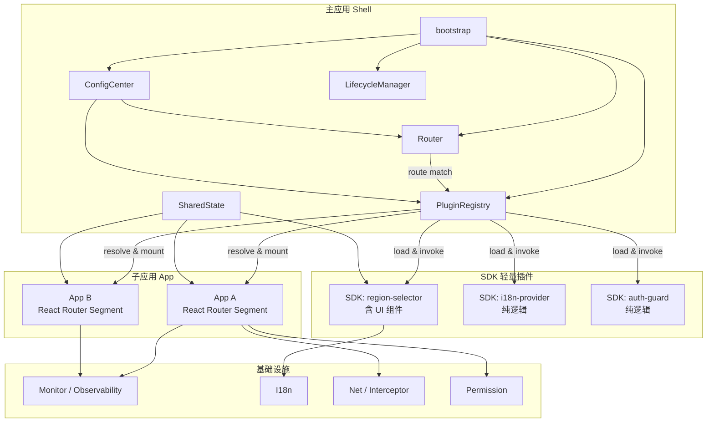
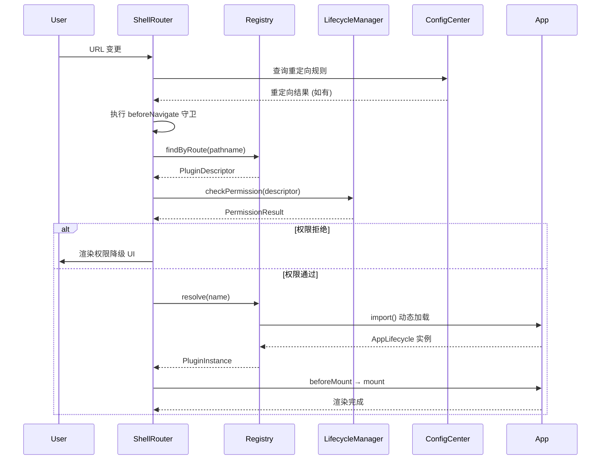

# 星坞框架设计 — 主应用（Shell）

> 本文档聚焦 **主应用壳层（Shell）** 的架构设计、核心模块与工程配置。
> 万星入坞，一壳相承。
>
> 配套文档：[子应用](./Xingwu框架设计-子应用.md) · [SDK 轻量组件](./Xingwu框架设计-SDK轻量组件.md)

---

## 一、设计动机与背景

### 1.1 设计动机

星坞框架的核心设计思想来源于大规模企业级应用的实践验证：

| 核心理念 | 价值 |
|---------|------|
| 壳层 + 按需业务包 | 首屏只加载壳与当前业务，其余按需拉取 |
| 运行时路由 + 配置驱动 | 不重新发版即可变更路由/重定向/灰度 |
| 三层插件体系 | 壳层 → 子应用 → SDK，分层解耦 |
| 生命周期编排 | `beforeNavigate → beforeMount → mount → afterMount → update → beforeUnmount → unmount` 全链路管控 |
| 响应式配置 | 配置中心提供类型安全、响应式配置管理 |

### 1.2 设计目标

| 目标 | 说明 |
|-----|------|
| **同构技术栈** | 主应用与子应用使用同一技术栈（React + TypeScript），共享类型与组件 |
| **轻量子应用** | 提供「子应用」与「SDK」两种集成粒度，SDK 更轻量、更聚焦 |
| **现代工具链** | Vite 构建、ESM 原生加载、TypeScript 类型安全 |
| **配置驱动** | 运行时配置中心支持灰度、A/B、动态路由 |
| **开发体验** | 完整类型提示、模块热替换、独立开发/调试能力 |

---

## 二、Shell 整体架构

### 2.1 架构全景



### 2.2 分层说明

| 层级 | 职责 |
|-----|------|
| **Shell（壳层）** | 应用初始化、路由分发、插件注册表、配置中心 |
| **App（子应用）** | 独立业务模块，拥有自己的路由段和 UI 树 |
| **SDK（轻量插件）** | 不占路由段的功能模块；可纯逻辑，也可提供 UI 组件供宿主渲染 |
| **Infrastructure（基础设施）** | 监控、网络、国际化、权限等横切关注点 |

---

## 三、核心模块设计

### 3.1 PluginRegistry（插件注册表）

统一管理所有插件的注册、解析与模块缓存。

> **U-2 已决**：`PluginRegistry` 是唯一的注册事实来源，所有插件（App + SDK）的描述符与模块缓存均由其管理。`SdkRegistry` 作为其**门面（Facade）**，仅暴露 SDK 消费侧 API，内部委托 `PluginRegistry` 完成 resolve。

**设计原理 — 单一事实来源（Single Source of Truth）**：

插件注册表的核心矛盾在于「统一管理」与「消费简洁」的平衡。如果 App 和 SDK 各自维护注册表，会导致描述符与依赖解析分叉——同一个插件可能被两边注册了不同版本，依赖拓扑无法完整计算。星坞采用 **统一注册表 + 门面** 模式解决这一矛盾：

- `PluginRegistry` 持有全局唯一的插件 Map 与模块缓存，负责 `register → resolve → cache` 的完整生命周期
- `SdkRegistry` 不持有任何状态，仅作为 Facade 将 SDK 消费侧 API（`has`、`get`、`load`、`getComponent`）翻译为对 `PluginRegistry` 的委托调用
- 这使得依赖解析（如 SDK A 依赖 SDK B）可以在 `PluginRegistry` 内完成全局拓扑排序，无需跨注册表通信

**模块缓存策略**：

`resolve(name)` 使用 `moduleCache: Map<string, Promise<unknown>>` 缓存已加载的模块 Promise。这意味着：
- 同一插件只会被 `import()` 一次，后续调用直接返回缓存的 Promise
- 缓存的是 Promise 而非模块本身，因此并发 `resolve` 不会导致重复加载
- `unregister` 时同步清除缓存，确保插件卸载后可被重新加载

> 完整实现见 [`packages/shell/src/registry.ts`](../packages/shell/src/registry.ts)

### 3.2 Router（路由系统）

基于 React Router 扩展，在壳层实现子应用路由分发。

**路由分发流程**：



**设计原理 — 权限前置（U-6 已决）**：

权限检查在 `import()` 加载之前执行，这是基于资源安全与性能的双重考量：若先加载模块再校验权限，敏感内容已进入浏览器内存，且浪费了网络带宽与 JS 解析开销。星坞的策略是**先查描述符中的权限声明，再决定是否加载**——`PluginDescriptor` 中的 `navItem` 和 `permission` 字段足够壳层做出权限判断，无需加载模块本体。

**路由离开拦截策略（U-5 已决）**：

壳层基于 React Router v6 的 `useBlocker` API 统一实现路由离开拦截。子应用通过 `ctx.router.beforeLeave` 注册守卫函数，壳层在 `beforeUnmount` 阶段聚合所有守卫结果：任一守卫返回 `false` → 阻止离开，弹出确认对话框；全部通过 → 正常卸载。浏览器后退按钮通过 `useBlocker` 同一入口处理，不依赖 `beforeunload` 事件（仅用于关闭标签页/刷新）。

> 路由分发实现见 [`packages/shell/src/App.tsx`](../packages/shell/src/App.tsx)
>
> 路由守卫实现见 [`packages/shell/src/lifecycle.ts`](../packages/shell/src/lifecycle.ts)（`registerRouteGuard` / `checkRouteGuards`）

### 3.3 ConfigCenter（配置中心）

提供类型安全的运行时配置管理，支持响应式更新、插件级作用域隔离与灰度发布。

> **U-7 已决**：配置类型校验采用 **Zod Schema** 方案。理由：① 与 TypeScript 类型推导一体化，运行时校验与编译时类型共享同一份 Schema 定义；② Zod 体积小（~13KB gzipped），适合浏览器环境；③ 生态成熟，支持 JSON Schema 互转。各插件在 `plugin.config.ts` 的 `configSchema` 字段提供 Zod Schema，框架在 `ConfigCenter.set` 时自动校验。

**设计原理 — 配置作用域隔离**：

配置中心的核心挑战是「全局共享」与「插件隔离」的平衡。一个插件不应感知其他插件的配置 key，但框架需要统一管理所有配置的存储、刷新与持久化。

星坞采用 **命名空间前缀 + 作用域门面** 的方案：

- 底层 `store: Map<string, unknown>` 用扁平 key-value 存储所有配置，key 遵循 `pluginName.configKey` 格式
- `forPlugin(pluginName)` 返回一个 `PluginConfigScope` 门面对象，自动为所有读写操作加上 `pluginName.` 前缀
- 插件只能通过 `forPlugin` 返回的作用域操作配置，无法读写其他插件的命名空间
- 远程刷新（`refresh()`）拉取全量配置后通过 `batchUpdate()` 一次性写入，减少 watcher 触发次数

**配置数据流**：

```
┌──────────────┐     ┌──────────────┐     ┌──────────────┐
│  配置服务 API │────▶│  ConfigCenter │────▶│   插件消费    │
│  (远程)       │     │  (内存+响应式)│     │  ctx.config  │
└──────────────┘     └──────┬───────┘     └──────────────┘
                            │
                     ┌──────┴───────┐
                     │  本地缓存     │
                     │  (localStorage│
                     │   / IndexedDB)│
                     └──────────────┘
```

> 完整实现见 [`packages/shell/src/config-center.ts`](../packages/shell/src/config-center.ts)
>
> 配置类型定义见 [`packages/types/src/config.ts`](../packages/types/src/config.ts)

### 3.4 SharedState（共享状态）

提供受控的跨插件状态共享，避免全局变量污染与隐式依赖。

**设计原理 — 受控共享 vs 全局 Store**：

跨插件状态共享有三种经典方案：① 全局 Store（如 Redux）—— 强依赖单一状态管理库，插件间耦合度高；② window 全局变量 —— 零约束，但命名冲突与隐式依赖无法控制；③ 受控 EventBus —— 中间态，在灵活性与约束之间取平衡。

星坞选择方案③，并增加以下约束使其从「松散 EventBus」升级为「受控状态总线」：

- **命名空间强制**：所有 key 遵循 `pluginName.stateKey` 格式，避免跨插件 key 冲突
- **写入审计**：每次 `setState` 自动记录 `{ key, value, timestamp }` 到 `writeLog`，供运维与调试追踪状态变更链
- **批量更新**：`batchSet()` 允许一次写入多个 key，但每个 key 各触发一次订阅者通知，确保订阅者拿到完整的变更信息
- **函数式更新**：`setState` 支持 `(prev: T) => T` 回调，避免竞态条件下基于旧值计算的问题

**设计约束**：

- 所有跨插件状态**必须**通过 SharedState 传递，禁止直接访问 `window`
- SharedState 的 key 遵循 `pluginName.stateKey` 命名空间
- 写入操作自动记录来源插件（用于监控与调试）

> 完整实现见 [`packages/shell/src/shared-state.ts`](../packages/shell/src/shared-state.ts)

### 3.5 LifecycleManager（生命周期管理器）

编排插件的挂载、更新、卸载流程。

**设计原理 — 生命周期钩子的执行语义**：

生命周期管理器的核心职责是**按序执行钩子并处理异常与中断**。关键设计点：

- **beforeUnmount 可中断**：`beforeMount` 和 `afterMount` 不支持中断（它们是通知型钩子），但 `beforeUnmount` 返回 `false` 可阻止卸载——这用于处理「表单未保存」等用户交互场景
- **状态机驱动**：每个插件实例有 `registered → loaded → active → inactive` 状态流转，`LifecycleManager` 通过 `PluginRegistry.setStatus()` 推进状态，其他模块（如 `SdkRegistry`）据此判断是否需要 `resolve`
- **SDK 的 getComponents 时机**：`getComponents()` 在 `activate` 之后调用，因为它需要 `SdkContext`（包含配置、共享状态等运行时依赖），只有在 `activate` 完成后这些依赖才可用

> 完整实现见 [`packages/shell/src/lifecycle.ts`](../packages/shell/src/lifecycle.ts)

### 3.6 SdkRegistry（SDK 门面）

> **设计决策（U-2 已决）**：`PluginRegistry` 是唯一的注册事实来源。`SdkRegistry` 作为其**门面（Facade）**，仅暴露 SDK 消费侧 API，内部委托 `PluginRegistry` 完成 resolve。此设计保证描述符与依赖解析单一事实来源，同时保持消费 API 的简洁。

**设计原理 — 门面模式的边界**：

`SdkRegistry` 的门面不是简单的方法转发，它在三个关键点增加了业务语义：

1. **API 获取语义**：`get<T>(name)` 不是直接返回模块导出，而是从 `SharedStateBus` 读取 `{name}.api`——这是 SDK 在 `activate` 阶段通过 `ctx.sharedState.setState` 发布的 API 实例。这种约定使得 API 的获取与 SDK 的生命周期解耦：消费者无需关心 SDK 是否已加载，只需订阅 `SharedStateBus` 即可感知 API 就绪。
2. **UI 组件缓存**：`cacheComponents` 在 `activate` 后提取 `getComponents()` 返回的组件映射并缓存，避免每次 `getComponent()` 都要重新调用 `getComponents()`。缓存与 `reload()` 联动——`reload` 会 `deactivate → activate`，重建组件缓存。
3. **preload 的语义**：`preload` 不仅是 `resolve`（加载模块），还执行 `activate`（初始化 SDK），因为预加载的目的是「首屏即可用」，仅加载不激活无意义。

> 完整实现见 [`packages/shell/src/sdk-registry.ts`](../packages/shell/src/sdk-registry.ts)

---

## 四、权限与安全

### 4.1 权限模型

多级权限体系，TypeScript 类型化。

**设计原理 — 权限校验链**：

权限校验采用**链式检查**而非单一判断，原因是不同业务场景需要不同级别的权限保证：

- `admin` 检查：验证是否拥有管理员角色
- `identity` 检查：验证是否完成实名认证
- `rbac` 检查：验证 RBAC 服务级权限
- `custom` 检查：业务自定义权限逻辑

`checkChain(nodes)` 按数组顺序依次执行，第一个被拒绝的节点即为最终结果。这种设计允许插件根据业务需要组合不同级别的权限校验，而非接受一个「全有或全无」的二元判断。

> 权限类型定义见 [`packages/types/src/infra.ts`](../packages/types/src/infra.ts)
>
> 权限实现见 [`packages/shell/src/infra/permission.ts`](../packages/shell/src/infra/permission.ts)

### 4.2 安全机制

| 机制 | 说明 |
|-----|------|
| CSRF 防护 | 自动在请求中注入 CSRF Token |
| Session 守卫 | 检测 Session 变更，防止 CSRF |
| Owner 守卫 | 检测开发商账号变更 |
| 插件沙箱 | SDK 运行在受限上下文中，禁止直接操作 `window` |
| 配置审计 | ConfigCenter 所有写入自动记录来源插件与调用栈 |

### 4.3 插件沙箱与威胁模型（U-1 已决）

**威胁模型分级**：

| 信任等级 | 来源 | 威胁假设 | 隔离策略 |
|---------|------|---------|---------|
| **L1 受信** | 内部 Monorepo 发布的插件 | 代码缺陷（非恶意），如全局变量泄漏 | 公约 + 审计 + 代码审查 |
| **L2 半信** | 内部但跨团队发布的插件 | 可能包含不兼容的副作用或低质量代码 | 公约 + 运行时监控 + `SdkContext` 受限 API |
| **L3 不信** | 第三方/外部贡献的插件 | 可能包含恶意代码 | CSP + SRI + iframe 隔离 |

**首版实现策略**：默认 L1/L2 场景，采用「**公约 + 受限上下文 + 运行时审计**」：

1. **受限上下文**：插件只能通过 `AppContext` / `SdkContext` 与框架交互，直接访问 `window` 的写入行为通过 Proxy 拦截并记录告警
2. **CSP（Content Security Policy）**：壳层 HTML 注入 CSP Header，限制 `script-src` 仅允许静态资源域名，禁止 `eval` / `inline script`
3. **SRI（Subresource Integrity）**：远程加载的插件入口必须携带 `integrity` 哈希，防止静态资源篡改
4. **运行时审计**：`SharedStateBus` 写入、`ConfigCenter` 写入均记录来源插件与调用栈；`Monitor` 自动采集 `window` 写入告警

**L3 不信场景的降级策略**（后续版本）：

- 不可信插件使用 `iframe[sandbox]` 隔离运行，通过 `postMessage` 与壳层通信
- 或使用 Web Worker 运行纯逻辑 SDK，UI 组件由壳层代为渲染
- 此策略暂不实现首版，但架构上预留 `PluginDescriptor.sandbox.mode: 'context' | 'iframe' | 'worker'` 扩展点

---

## 五、监控与可观测性

### 5.1 监控事件体系

框架定义了结构化的监控事件类型，覆盖插件生命周期、路由、SDK、性能、健康检查和配置变更六大领域。每个事件携带语义化的 payload，便于后端聚合分析。

> 监控类型定义见 [`packages/types/src/infra.ts`](../packages/types/src/infra.ts)
>
> 监控实现见 [`packages/shell/src/infra/monitor.ts`](../packages/shell/src/infra/monitor.ts)

### 5.2 性能打点

框架在关键路径上自动采集性能指标：

- **首屏渲染**：从路由匹配到子应用 `afterMount` 的端到端耗时
- **SDK 加载**：从 `import()` 到 `activate` 完成的耗时
- **API 调用**：网络请求的耗时与状态码

---

## 六、国际化

### 6.1 设计方案

框架级国际化提供默认回退链机制：`ko → intl → en → zh`。当某个 key 在当前语言包中缺失时，按回退链逐级查找，确保不会出现空白文本。

### 6.2 插件级国际化

每个插件独立维护翻译文件，框架按需加载。插件的 `PluginDescriptor.configSchema` 中可声明 `intlId`，SDK 激活时框架自动加载对应语言包。

> 国际化实现见 [`packages/shell/src/infra/i18n.ts`](../packages/shell/src/infra/i18n.ts)

---

## 七、工程与构建体系

### 7.1 Monorepo 结构

```
xingwu-ops-fe/
├── packages/
│   ├── shell/                     # 主应用壳
│   │   ├── src/
│   │   │   ├── bootstrap.ts       # 框架初始化
│   │   │   ├── registry.ts        # 插件注册表
│   │   │   ├── config-center.ts   # 配置中心
│   │   │   ├── shared-state.ts    # 共享状态
│   │   │   ├── lifecycle.ts       # 生命周期管理
│   │   │   ├── sdk-registry.ts    # SDK 注册表
│   │   │   ├── layout/            # 布局组件
│   │   │   ├── infra/             # 基础设施实现
│   │   │   └── App.tsx            # 壳层根组件
│   │   ├── vite.config.ts
│   │   └── package.json
│   │
│   ├── types/                     # 共享类型定义
│   │   └── src/
│   │       ├── plugin.ts
│   │       ├── lifecycle.ts
│   │       ├── context.ts
│   │       ├── config.ts
│   │       └── infra.ts
│   │
│   ├── vite-plugin/               # 构建插件
│   │
│   ├── apps/                      # 子应用
│   │   └── product/
│   │
│   └── sdks/                      # SDK 插件
│       ├── region-selector/
│       └── auth-guard/
│
├── styles/                        # 共享样式（Tailwind 基础）
├── pnpm-workspace.yaml
├── tsconfig.base.json
└── package.json
```

### 7.2 构建策略

| 维度 | 说明 |
|-----|------|
| 构建工具 | Vite (Rollup/Rolldown) |
| 模块合并 | 自动代码分割 |
| 共享依赖 | `manualChunks` 自动抽取 |
| 开发热更新 | HMR (毫秒级) |
| Tree Shaking | ESM 原生支持 |
| 类型检查 | TypeScript |

**分层构建策略**：

```
┌─────────────────────────────────────────────────┐
│                 构建产物                          │
├─────────────────────────────────────────────────┤
│                                                  │
│  ┌──────────────┐  Shell 包 (首屏加载)           │
│  │  shell.js    │  - 框架核心代码                │
│  │  shell.css   │  - 壳层布局与样式              │
│  └──────────────┘                               │
│                                                  │
│  ┌──────────────┐  Vendor 包 (长期缓存)          │
│  │  vendor.js   │  - React, React Router, etc.  │
│  └──────────────┘                               │
│                                                  │
│  ┌──────────────┐  App 包 (按需加载)             │
│  │  product-[hash].js│  - 子应用业务代码            │
│  │  order-[hash].js│                             │
│  └──────────────┘                               │
│                                                  │
│  ┌──────────────┐  SDK 包 (按需/预加载)          │
│  │  sdk-rs-[h].js│ - SDK 功能代码               │
│  └──────────────┘                               │
│                                                  │
│  ┌──────────────┐  Common 包 (自动抽取)          │
│  │  chunk-[hash] │ - 共享的 utils/components    │
│  └──────────────┘                               │
│                                                  │
└─────────────────────────────────────────────────┘
```

> Shell Vite 配置见 [`packages/shell/vite.config.ts`](../packages/shell/vite.config.ts)

### 7.3 开发模式

**独立开发**（子应用可单独启动）：

```bash
# 启动子应用独立开发服务器
cd packages/apps/product
pnpm dev
# 访问 http://localhost:5173
```

**联调模式**（主应用 + 指定子应用）：

```bash
# 启动 Shell + 远程加载子应用
cd packages/shell
pnpm dev
# 访问 http://localhost:3000/product
# Shell 从本地开发服务器动态 import 子应用
```

### 7.4 Import Maps 与版本管理

利用浏览器原生 Import Maps 实现模块共享与版本协商。

> **U-4 已决**：Import Maps 生产策略如下——
>
> **默认启用**，浏览器底线为 Chrome 89+ / Edge 89+ / Firefox 108+ / Safari 16.4+（均已支持 `importmap`）。
> 降级方案：对不支持 Import Maps 的浏览器，回退为**壳内打包映射表**——即壳层 Vite 构建时将 `react`/`react-dom` 等打入 `vendor.js`，子应用构建仍标 `external`，但运行时从壳的 `window.__REACT_SHARED__` 获取。
>
> **CORS/CSP**：静态资源服务器需配置 `Access-Control-Allow-Origin: *`（或壳域名白名单）；CSP 的 `script-src` 需包含静态资源域名并加 `'unsafe-inline'` 以允许 `importmap` script 块。
>
> **与 Vite 产物路径对齐**：开发模式使用 Vite dev server 的裸模块代理；生产模式 `importmap` 由壳层构建插件 `@xingwu/vite-plugin` 自动从 `package.json` 依赖版本生成，无需手写。

**设计原理 — 模块共享的必要性**：

React 的 Hooks 机制要求整个应用使用同一份 React 实例，否则 `useState`、`useContext` 等 Hook 会因实例不一致而崩溃。传统的 NPM 包管理无法保证这一点——壳层和子应用各自 `import React` 时，构建工具可能将其打包为不同副本。Import Maps 通过浏览器层面的模块解析拦截，将所有 `import 'react'` 统一映射到同一份资源 URL，从根本上解决了多实例问题。

> 构建插件实现见 [`packages/vite-plugin/`](../packages/vite-plugin/)
>
> 运行时共享机制见 [`packages/shell/src/main.tsx`](../packages/shell/src/main.tsx)（`__REACT_SHARED__` 和 `__ANTD_SHARED__`）

### 7.5 远程插件入口与发布管理（U-3 已决）

构建期 `entry: './src/...'` 是本地开发路径，运行时需要区分远程入口。解决方案：`PluginDescriptor` 的 `entry` 字段在本地开发时为相对路径，在**发布/注册阶段**由 CI 自动替换为静态资源 URL。

**设计原理 — 入口地址的配置化**：

插件入口从「构建时硬编码」变为「运行时配置」，是配置驱动架构的基础。这带来三个关键能力：

1. **灰度发布**：不同用户看到同一插件的不同版本，只需在配置中心为不同灰度规则返回不同 `entry` URL
2. **秒级回滚**：回滚无需重新构建，只需在配置中心将插件描述符指向上一版本的资源 URL + SRI 即可
3. **独立部署**：子应用/SDK 可以独立构建发布，壳层无需重新打包

**发布与回滚流程**：

```
┌──────────────┐     ┌──────────────┐     ┌──────────────┐
│ CI 构建      │────▶│ 静态资源发布  │────▶│ 配置中心注册  │
│ vite build   │     │ 上传+分发    │     │ 写入新版本   │
│ 生成 SRI     │     │ 返回资源 URL │     │ 描述符       │
└──────────────┘     └──────────────┘     └──────┬───────┘
                                                  │
                                          ┌───────┴──────┐
                                          │  灰度策略      │
                                          │  percentage   │
                                          │  whitelist    │
                                          └───────┬──────┘
                                                  │
                                          ┌───────▼──────┐
                                          │  回滚 = 配置  │
                                          │  中心切回旧版  │
                                          │  描述符       │
                                          └──────────────┘
```

---

## 八、框架配置参考

### 8.1 ShellConfig

> 完整类型定义见 [`packages/types/src/config.ts`](../packages/types/src/config.ts)
>
> 运行时配置实例见 [`packages/shell/src/main.tsx`](../packages/shell/src/main.tsx)

### 8.2 启动流程

Shell 的启动流程遵循 `创建 → 挂载 → 渲染` 三步：

1. `createShell(config)` — 根据 `ShellConfig` 创建 Shell 实例，初始化所有核心模块（Registry、ConfigCenter、SharedStateBus、LifecycleManager、Infrastructure）
2. `shell.mount('#root')` — 注册插件描述符、预加载 SDK、启动配置中心远程刷新
3. `createRoot().render(<ShellApp>)` — 渲染 React 应用，BrowserRouter 接管路由分发

> 启动实现见 [`packages/shell/src/bootstrap.ts`](../packages/shell/src/bootstrap.ts) 和 [`packages/shell/src/main.tsx`](../packages/shell/src/main.tsx)

---

## 九、设计决策与取舍（Shell 侧）

| 决策 | 选择 | 理由 |
|-----|------|------|
| CSS 隔离方案 | CSS Modules 默认，Shadow DOM 可选 | CSS Modules 零运行时开销；Shadow DOM 提供严格隔离但兼容性需考量 |
| 路由方案 | React Router 扩展而非自研 | 减少维护成本，生态成熟，扩展性足够 |
| 状态共享 | 轻量 EventBus 而非全局 Store | 插件间松耦合，避免强依赖单一状态管理库 |
| 构建模式 | 独立构建而非 Runtime Federation | 独立构建更稳定、更易调试；Federation 增加运行时复杂度 |
| 子应用渲染 | `createRoot` 直接渲染而非 iframe | 同技术栈下 iframe 开销不必要 |
| 插件注册 | 运行时描述符而非编译时硬编码 | 配置驱动，支持动态增减插件 |
| Registry 架构（U-2） | PluginRegistry 单一事实来源 + SdkRegistry 门面 | 避免双注册表导致描述符与依赖解析分叉 |
| 配置校验（U-7） | Zod Schema | 运行时校验与编译时类型共享同一 Schema 定义；体积小、生态成熟 |
| 沙箱策略（U-1） | 首版公约+审计，预留 L3 扩展点 | 内部插件信任度高，完整沙箱引入的复杂度与收益不对等 |
| Import Maps（U-4） | 默认启用 + 壳内打包降级 | 现代浏览器已广泛支持；降级方案保证兼容性 |

---

*文档版本：2.0.0*
*最后更新：2026-05-15*
